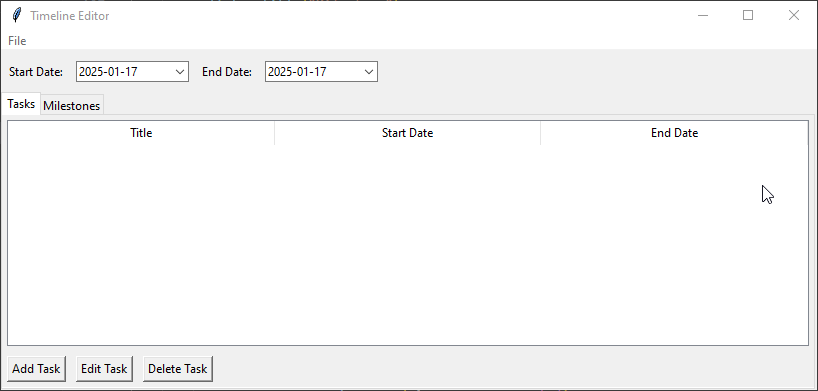
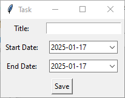

# Timeline Editor

An intuitive timeline editor built with Python and Tkinter for managing project tasks and milestones stored in a JSON file. This tool is designed to be user-friendly, offering a graphical interface to add, edit, and remove tasks and milestones, while providing features like a date picker and percentage tracking for milestones.

---

## Features

### Key Features:
- **Load and Save JSON Files:**
  - Load project data from a JSON file.
  - Save updates to the same file or export to a new JSON file.
- **Task Management:**
  - Add, edit, and delete tasks with fields for title, start date, and end date.
- **Milestone Management:**
  - Add, edit, and delete milestones with fields for title, date, color, and percentage.
- **Interactive Date Picker:**
  - Use a built-in date picker for all date fields to ensure accuracy and ease of use.
- **Intuitive Interface:**
  - Easy-to-navigate interface with separate tabs for tasks and milestones.

---

## Getting Started

### Prerequisites
Ensure you have Python installed (version 3.7 or higher). Install the required dependencies using the following command:

```bash
pip install tkcalendar
```

### Installation
1. Clone the repository:
   ```bash
   git clone https://github.com/ippous/timeline-editor.git
   ```
2. Navigate to the project directory:
   ```bash
   cd timeline-editor
   cd src
   ```
3. Run the editor:
   ```bash
   python timeline_editor.py
   ```

---

## JSON Data Structure

The application reads and writes data in the following JSON format:

```json
{
    "start_date": "2023-01-01",
    "end_date": "2023-12-31",
    "tasks": [
        {
            "title": "Task A",
            "start_date": "2023-01-01",
            "end_date": "2023-03-01"
        }
    ],
    "milestones": [
        {
            "title": "Milestone 1",
            "date": "2023-02-15",
            "color": "blue",
            "percentage": 50
        }
    ]
}
```

### Fields:
- **start_date** and **end_date:** Overall project timeline.
- **tasks:**
  - `title`: The task name.
  - `start_date`: Task start date.
  - `end_date`: Task end date.
- **milestones:**
  - `title`: The milestone name.
  - `date`: Milestone date.
  - `color`: Display color for the milestone.
  - `percentage`: Completion percentage for the milestone.

---

## How to Use

1. **Load Data:**
   - Use the `File > Open` menu to load a JSON file.
2. **Edit Tasks or Milestones:**
   - Navigate to the "Tasks" or "Milestones" tab.
   - Use the "Add", "Edit", or "Delete" buttons to manage entries.
3. **Save Data:**
   - Use the `File > Save` menu to overwrite the existing file.
   - Use `File > Save As` to create a new file.

---

## Screenshots

### Main Interface:



### Adding a Task:



---

